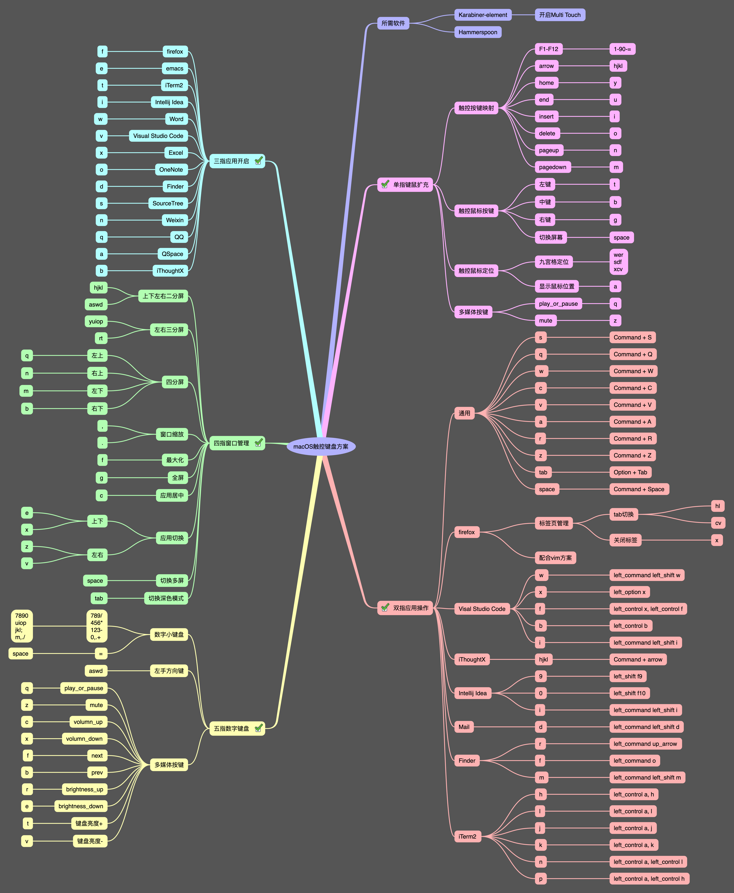

# MultiN触控键盘模式

本项目（[项目git地址](https://github.com/chenlmcom/MultiN)）分享一种多模式键盘操作方案，主要适用于笔记本，通过结合触控板及键盘，可极大地丰富键盘的操作性。

## 多点触控多模式键盘方案

本方案的思路是通过多指触控方式的不同，将键盘的按键映射成不同的模式，从而扩充键盘按键，缩短键程，提交输入效率。比如，将`单指触控+hjkl`映射成方向键，`四指触控+hjkl`映射成窗口布局快捷键。

为了方便记忆，本方案将控制方式分成四种模式：

`单指触控+按键`：单指键盘扩充模式

`双指触控+按键`：双指程序操控模式

`三指触控+按键`：三指程序开启模式

`四指触控+按键`：四指窗口管理模式

`五指触控+按键`：五指数字键盘模式

### 触控键盘映射方案图

### 单指键盘扩充模式

本模式通过单指触控+按键的方式将笔记本小键盘扩充成全键盘，按键定义如下（Multi_1表示单指触控）：

`Multi_1 + h` -> 左方向键

`Multi_1 + j` -> 下方向键

`Multi_1 + k` -> 上方向键

`Multi_1 + l` -> 右方向键

...

### 双指程序操控模式

本模式将双指触控+按键映射成不同程序的操作快捷键，现已定义的程序操控按键如下（Multi_2表示双指触控）：

通用按键：

`Multi_2 + s` -> Command + S

`Multi_2 + w` -> Command + W

`Multi_2 + q` -> Command + Q

Firefox:

`Multi_2 + h` -> privious tab

`Multi_2 + l` -> next tab

`Multi_2 + j` -> page down

`Multi_2 + l` -> page up

...

### 三指程序开启模式

本模式将三指触控+按键映射成开启不同程序，现已定义的程序操控按键如下（Multi_3表示三指触控）：

`Multi_3 + f` -> Firefox

`Multi_3 + e` -> Emacs

`Multi_3 + t` -> iTerm2

`Multi_3 + i` -> Intellij Idea

...

### 四指窗口管理模式

本模式将四指触控+按键映射成窗口管理快捷键，窗口管理使用了Harmmerspoon，定义的按键如下（Multi_4表示四指触控）：

`Multi_4 + h` -> 二分屏左侧

`Multi_4 + l` -> 二分屏右侧

`Multi_4 + j` -> 二分屏下侧

`Multi_4 + k` -> 二分屏上侧

`Multi_4 + f` -> 全屏

...

### 五指数字键盘模式

本模式将五指触控+按键映射成数字键盘，在主键盘区域模拟数字键，方便输入数字，定义的按键如下（Multi_5表示五指触控）：

`Multi_5 + m` -> 0

`Multi_5 + /` -> +

`Multi_5 + j` -> 1

`Multi_5 + space` -> =

...

## 实现方式

目标本方案仅在macOS上通过开源软件实现。

## 所用软件

* Hammerspoon + WinWin插件
* Karabiner-Element

  需开启Multi Touch插件

## 使用方式

dist目录中为已生成好的配置文件，可直接使用。

multi_n.json为Karabiner_Element配置文件，可复制或链接到Karabiner_Element配置目录中启用。
Karabiner_Element配置目录为/Users/<用户名>/.config/karabiner/assets/complex_modifications。

config.lua为Hammerspoon配置文件，在Harmmerspoon的配置文件中引入即可。

## 自定义键盘映射

需要自定义的，可修改src目录中的键盘映射配置文件config.ini，然后执行makejson.py文件，即可重新生成multi_n.json配置文件。
